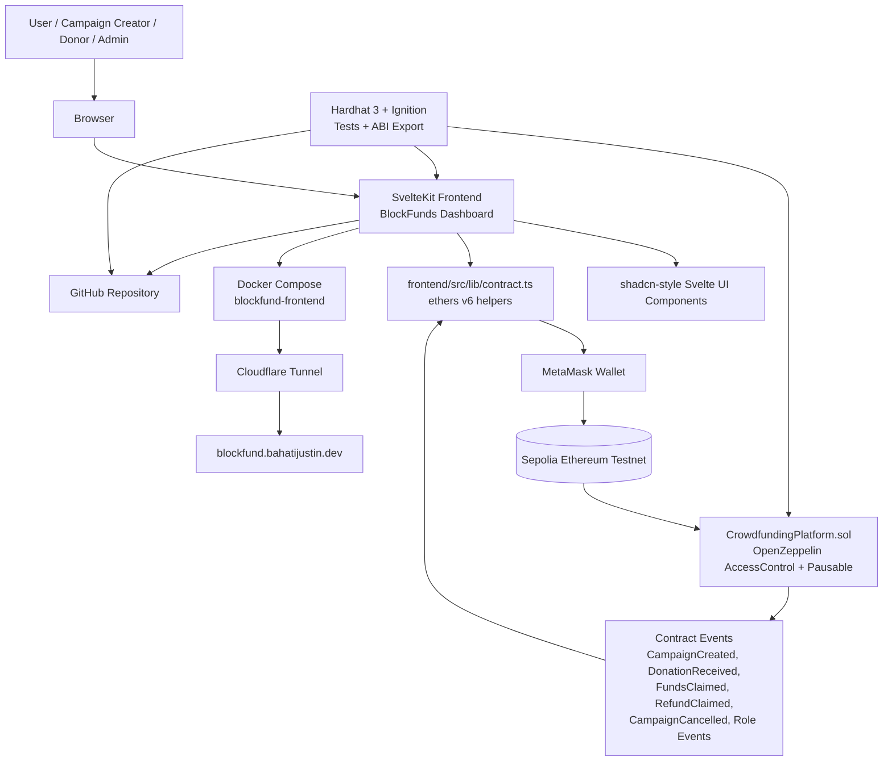

# BlockFunds Crowdfunding DApp

BlockFunds is a full-stack blockchain crowdfunding DApp built for Group 8. It includes a Solidity/Hardhat backend, a SvelteKit dashboard frontend, MetaMask integration, Sepolia deployment metadata, Docker production deployment, and Playwright E2E tests.

Live frontend:

```text
http://blockfund.bahatijustin.dev
```

Current Sepolia contract:

```text
0x265c7Ed47C7880f0f0ce2F1Ee44221a46031971f
```

## Features

- Create ETH crowdfunding campaigns.
- Donate to active campaigns.
- Creators can claim funds as soon as the funding target is reached.
- Donors can claim refunds for failed or cancelled campaigns.
- Campaign creators can cancel active campaigns.
- Admin-controlled creator role management.
- Live on-chain campaign/activity loading from contract events.
- No mock/demo campaign data in the production UI.
- Responsive SvelteKit dashboard with routed pages.

## Stack

- Solidity `0.8.28`
- Hardhat 3
- OpenZeppelin Contracts 5
- Hardhat Ignition
- ethers v6
- SvelteKit
- shadcn-style local Svelte components
- Playwright
- Docker Compose

## Project structure

```text
contracts/CrowdfundingPlatform.sol        Main smart contract
ignition/modules/CrowdfundingPlatform.ts  Ignition deployment module
scripts/export-abi.ts                     ABI/deployment export script
scripts/test-local-fullstack.sh           Full local backend/frontend smoke test
scripts/local-smoke-test.ts               Local contract interaction smoke test
test/CrowdfundingPlatform.test.ts         Unit tests
frontend/                                 SvelteKit frontend app
frontend/src/lib/DashboardApp.svelte      Main routed dashboard UI
frontend/src/lib/contract.ts              Frontend contract helpers
frontend/src/routes/roles/+page.svelte    Role management route
docker-compose.yml                        Production frontend container config
```

## System architecture



### Architecture flow

1. Users interact with the SvelteKit dashboard in the browser.
2. MetaMask signs transactions and connects the frontend to Sepolia.
3. `frontend/src/lib/contract.ts` uses ethers v6 to read campaign data, send transactions, and query contract events.
4. `CrowdfundingPlatform.sol` manages campaigns, donations, refunds, creator claims, cancellation, pause controls, and RBAC.
5. Contract events populate the Activity page with live blockchain activity.
6. The production frontend runs in Docker and is exposed publicly through Cloudflare Tunnel.

## Frontend routes

- `/` — dashboard overview
- `/campaigns` — campaign list/actions and Create Campaign modal
- `/activity` — live contract event/activity feed
- `/roles` — role management page
- `/contract` — contract/network status

## Role management

Campaign creation is protected by `CREATOR_ROLE`. A wallet must have creator role before it can create campaigns.

Open the role management page:

```text
http://blockfund.bahatijustin.dev/roles
```

From `/roles`, you can:

- Connect/reconnect MetaMask.
- Check your own roles.
- Check any wallet address.
- Grant creator role.
- Revoke creator role.

Only the contract admin wallet can grant or revoke roles:

```text
0xA386432BbEC580A02561ec3Eb5a5c34905Bd9a60
```

If a non-admin wallet tries to grant/revoke roles, the frontend shows a clear admin-only error.

## Install

From this project directory:

```bash
npm install
npm --prefix frontend install
```

## Compile contracts

```bash
npm run compile
```

## Run backend tests

```bash
npm test
```

The test suite covers RBAC, campaign creation, donations, creator claims once target is reached, failed/cancelled refunds, duplicate claim/refund prevention, cancellation, and pause controls.

Type-check TypeScript scripts/tests:

```bash
npm run test:types
```

## Full local stack test

Run the full local pre-deployment check:

```bash
npm run test:local:fullstack
```

This command:

1. Starts or reuses a local Hardhat JSON-RPC node.
2. Compiles the contracts.
3. Runs the full unit test suite.
4. Performs a fresh localhost Ignition deployment.
5. Exports frontend ABI/deployment metadata.
6. Uses the frontend ABI against the local deployed contract to smoke-test:
   - creator role grant
   - campaign creation
   - donation
   - successful fund claim
   - failed campaign refund
   - cancellation refund
   - pause/unpause protection

## Local development

In terminal 1:

```bash
npm run node
```

In terminal 2:

```bash
npm run deploy:local
```

Export the local contract to the frontend:

```bash
CONTRACT_ADDRESS="0xLOCAL_CONTRACT_ADDRESS" CONTRACT_NETWORK="localhost" npm run export:abi
```

Start the frontend:

```bash
npm run frontend:dev
```

Open:

```text
http://localhost:5173
```

For MetaMask local testing, use:

```text
RPC URL: http://127.0.0.1:8545
Chain ID: 31337
Currency symbol: ETH
```

## Sepolia deployment

Copy `.env.example` and provide real values locally. Do not commit secrets.

```bash
export SEPOLIA_RPC_URL="https://sepolia.drpc.org"
export SEPOLIA_PRIVATE_KEY="0xYOUR_PRIVATE_KEY"
npm run deploy:sepolia
```

After deploying, export ABI/deployment metadata for the frontend:

```bash
CONTRACT_ADDRESS="0xDEPLOYED_CONTRACT_ADDRESS" \
CONTRACT_NETWORK="sepolia" \
CONTRACT_FROM_BLOCK="DEPLOYMENT_BLOCK" \
npm run export:abi
```

This writes:

- `frontend/src/contracts/CrowdfundingPlatform.json`
- `frontend/src/contracts/deployment.json`

Current checked-in deployment metadata points to Sepolia contract:

```text
Address: 0x265c7Ed47C7880f0f0ce2F1Ee44221a46031971f
From block: 11249668
```

## Frontend checks

```bash
npm run frontend:check
npm run frontend:test:e2e
npm run frontend:build
```

## Docker production frontend

Build and run the production frontend locally with Docker Compose:

```bash
docker compose up -d --build
```

The production container exposes the SvelteKit Node server on:

```text
127.0.0.1:8088 -> 3000
```

The deployed public hostname is served through Cloudflare Tunnel:

```text
http://blockfund.bahatijustin.dev
```

## Deliverables self-evaluation

Based on **“Deliverables (Applicable to All Groups)”** from `Activity 1#dApp Projects_DEADLINE_11_07_2026.docx`:

| Deliverable | Status | Evidence / Notes |
| --- | --- | --- |
| Deployed DApp on Sepolia Ethereum Test Network | ✅ Complete | Frontend: `http://blockfund.bahatijustin.dev`; contract: `0x265c7Ed47C7880f0f0ce2F1Ee44221a46031971f`. |
| Solidity smart contract(s) | ✅ Complete | `contracts/CrowdfundingPlatform.sol`. |
| Responsive frontend integrated with MetaMask | ✅ Complete | SvelteKit frontend with wallet connect, network checks, and responsive routed dashboard. |
| Evidence of RBAC implementation | ✅ Complete | OpenZeppelin `AccessControl`, `DEFAULT_ADMIN_ROLE`, `CREATOR_ROLE`, and `/roles` management page. |
| Blockchain event logging | ✅ Complete | Contract emits campaign, donation, claim, refund, cancellation, and role events; `/activity` reads live events. |
| IPFS integration, where applicable | ⚠️ Partial / metadata-ready | Campaigns include a `metadataURI` field for `ipfs://...` links, but the app does not yet upload files to IPFS directly. |
| NFT integration, where applicable | N/A | NFT functionality is not required for this crowdfunding DApp workflow. |
| GitHub repository containing all source code | ✅ Complete | `git@github.com:bajustone/mse-blockchain-and-dapps.git`, project directory `work_2-group-dapp/`. |
| System architecture diagram | ✅ Complete | Added Mermaid diagram in this README. |
| User manual | ⚠️ Partial | README includes setup, routes, role management, and deployment usage. A separate end-user manual can still be prepared if required. |
| Technical report, 15–20 pages | ⚠️ Pending | Source code and README are ready; formal report still needs to be written/exported. |
| 15–20 minute live demonstration | ✅ Demo-ready | Full workflow is supported: connect wallet, grant creator role, create campaign, donate, claim funds, view events. |

Overall readiness: **strong implementation readiness**, with the main remaining non-code deliverables being the formal technical report and, if required, a separate polished user manual.
